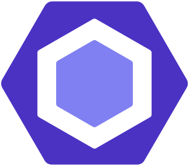

# Porfolio - Krzysztof Zygmunt (Chris)

I'm moving towards the backend, here are the last two projects under development and some smaller but interesting tasks. 

[GitHub repository](https://github.com/chriskodehub/porfolio)

### Technologies

      

### Tools

   

## About me

Hei. Jej heter Krzysztof. Jeg er en person som **liker utfordringer**. Jeg har akkurat startet mitt eventyr i programmerings bransjen. Jeg studerer intensivt og eksperimenterer med **prosjektene mine**.

Før det jobbet jeg i byggebransjen, noe som ga meg mye glede. Jeg bestemte meg imidlertid for å bytte yrke og har lært programmering i tre år. Det er på tide å bruke det jeg har lært, og jeg gleder meg til **å begynne å programmere** for et interessant selskap.

Jeg vil beskrive meg selv som **fleksibel**, **innovativ**, **nøyaktig** og villig til **å utvikle meg**. Jeg ser frem til en jobb der jeg kan bruke mine egenskaper for å utvikle firmaet jeg jobber i. Jeg har store ambisjoner og søker en spennende og meningsfull hverdag. Jeg **gir aldri opp** og jeg elsker å skape nye ting.

For meg **er problemer bare en utfordring** som jeg ser frem til å gå løs på.

[Download my CV](assets/cv-krzysztof-zygmunt.pdf)

## Projects

### [sample-project-webpack-firebase](https://github.com/chriskodehub/sample-project-webpack-firebase)

A development platform for Javascript-based applications, configured from scratch. Completed STAGE 1. STAGE 2 almost complete. STAGE 3 being planned.

### [kodehode-course-plan](https://github.com/chriskodehub/kodehode-course-plan)

My original project for Kodehode. I want to create an application that helps plan classes on the course. The project is in the intensive development phase. I will prepare a prototype and application development plan by **April 13, 2022**.

### Selected projects from Kodehode classes

1. [HTML form with. Parsing an html form with JavaScript and FormData()](https://github.com/chriskodehub/KH-12_html-forms) | [Live demo](https://chriskodehub.github.io/KH-12_html-forms/)
2. [Basic Website With HTML & CSS](https://github.com/chriskodehub/KH-10_basic-website-with-html-css) | [Live demo](https://chriskodehub.github.io/KH-10_basic-website-with-html-css/)
3. [Turn-based game](https://github.com/chriskodehub/KH-11_javascript-methodically-looping) | [Live demo](https://chriskodehub.github.io/KH-11_javascript-methodically-looping/game.html)
4. [Play with html input](https://github.com/chriskodehub/KH-5_buttons_del_2) | [Live demo](https://chriskodehub.github.io/KH-5_buttons_del_2/)
5. [QR-code component](https://github.com/chriskodehub/FEM-1_QR-code-component) | [Live demo](https://chriskodehub.github.io/FEM-1_QR-code-component/)
6. [Play with arrays and console](https://github.com/chriskodehub/KH-8_array-i-javascript) | [Live demo](https://chriskodehub.github.io/KH-8_array-i-javascript/)
7. [Play with html table](https://github.com/chriskodehub/KH-9_html-tables) | [Live demo](https://chriskodehub.github.io/KH-9_html-tables/)

If you want to contact me, the fastest way to do it is on GitHub 😁  
[Send me Issue](https://github.com/chriskodehub/porfolio/issues)
